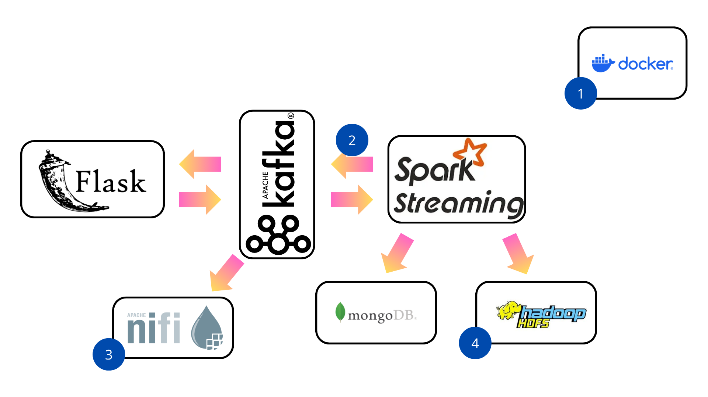
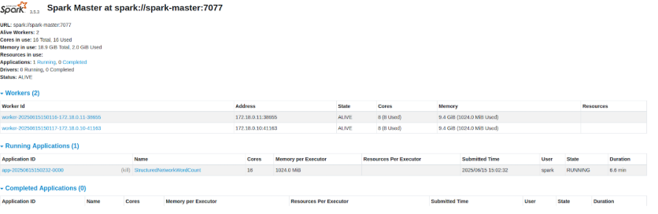
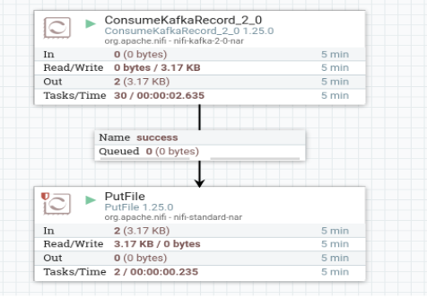
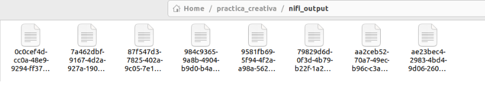
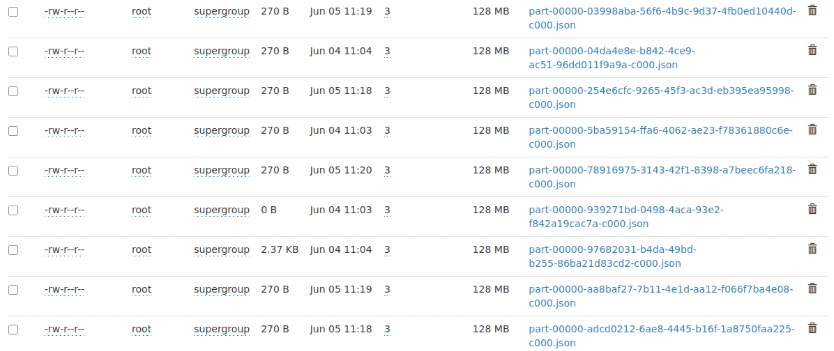
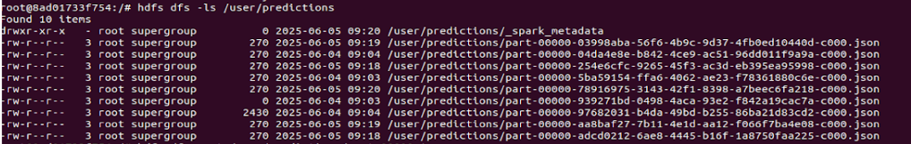

**PRÁCTICA FINAL IBDN**

*Ignacio Moyano Fernández y Juan Pérez Picciolato*  
---

*link a los recursos mencionados: [https://github.com/juanruu/ibdnfinal2/tree/main](https://github.com/juanruu/ibdnfinal2/tree/main)*

Tenemos un dataset que contiene información de vuelos pasados, incluyendo si han salido con retraso o no. A partir de esta información, queremos predecir si va a haber retrasos en un vuelo futuro. Para ello, entrenamos un modelo predictivo basado en el algoritmo RandomForest utilizando los datos que tenemos de vuelos antiguos. 

Tenemos que desplegar una arquitectura completa que nos permita, utilizando el modelo predictivo que hemos creado, realizar predicciones en tiempo real para nuevos vuelos.

El escenario de la práctica requiere desplegar los diferentes servicios que se muestran a continuación. Distinguimos 4 partes principales:  
	  

1. **Dockerización de la arquitectura base**   
     
   La primera parte de la práctica consiste en Dockerizar todos los servicios involucrados. Para ello creamos un docker compose que despliegue primeramente:  
     
- Flask: mediante una imagen de python que descargaba todos los requerimientos necesarios y ejecutaba el script predict\_flask.py

- Kafka: mediante la imagen bitnami/kafka:3.9 y un script ([start-kafka.sh](http://start-kafka.sh)) el   cual se encargaba de desplegar el tópico que transmitía la solicitud (flask-ml-delays-request).

- Spark: mediante la imagen bitnami/spark:3.5.3 deberemos crear 4 contenedores distintos pues el despliegue requería que fuera distribuido. Uno para el master y uno para cada worker (dos). Además un cuarto contenedor encargado de realizar el spark-submit el cual compila y ejecuta el código Scala para realizar la predicción.

- Mongo: mediante la imagen mongo:4.0 desplegamos un contenedor que se encargará de crear una colección donde guardaremos los datos históricos (generados con el script import\_distances.sh) que usa Scala para entrenar el modelo.

  Podemos observar el correcto despliegue distribuido del cluster de Spark dentro de la interfaz web del Spark Master:

2. **Escritura de la predicciones en Kafka** 

En el escenario anterior las predicciones se guardaban solo en Mongo y era desde ahí donde Flask las leía. En este punto tuvimos que crear otro tópico (flask-ml-delays-responses) añadir código en Scala para guardar las predicciones en ese tópico y añadir código en Flask para obtener las predicciones desde Kafka.

3. **Despliegue de NiFi para guardar las predicciones en un fichero txt**

Tuvimos que despegar un servicio nifi (herramienta de automatización de flujos) para definir un flujo que obtenía la predicción anteriormente guardada en el tópico de kafka, y guardarla tal cual en un archivo txt de manera automática cada 10 segundos.   
Para ello desplegamos otro contenedor que usaba la imagen apache/nifi:1.25. Definimos las claves para entrar en la interfaz web y, desde ahí, creamos un flujo que consistía de dos producers y un connector.

4. **Escritura de las predicciones en HDFS**

En último lugar tuvimos que guardar las predicciones en HDFS una base de datos distribuida la cual la componen dos nodos (datanode y namenode). 

También dockerizamos esta parte, usando las imágenes bde2020/hadoop-namenode/datanode:2.0.0-hadoop3.2.1-java y 2 contenedores uno para el NameNode encargado de coordinar el sistema y otro para el DataNode que almacena físicamente la predicción.

Podemos observar el correcto almacenamiento de las predicciones desde la interfaz web y desde el propio contenedor:

